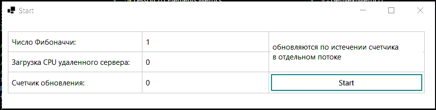

*[Назад](./../README.md)*  
  
### Задание для урока №1  
  
- [X] Создайте форму WPF или WinForms, разместите на ней текстовое поле и в другом потоке последовательно добавляйте на него числа Фибоначчи.  
- [X] В этой же форме добавьте регулятор, который будет отсчитывать, сколько секунд должно пройти, прежде чем появится следующее число.  
- [X] Изучите внимательно статичный класс Thread и не статичный класс. Найдите метод, который может прервать выполняющийся поток и зафиксируйте 
ту ошибку, которая формируется при отмене.  
- [X] Создайте класс-обертку над List<T>, что бы можно было добавлять и удалять элементы из разных потоков без ошибок.  
- [X] *Вернитесь к вашему старому проекту по отображению графиков с агентов мониторинга. Сделайте новое приложение, 
которое забирает данные через потоки, не используя async/await.  
  
---  

  
  
### Пояснения по выполнению задания  
  
Задание 1 и 2.  
Создано приложение WinForms. Один поток в приложении отвечает за создание и вывод чисел Фибоначчи на форму. Поток в нормальном состоянии находится 
в ожидании события обнуления счетчика и затем выводит очередное число на форму. За счетчик отвечает второй поток, который при обнулении устанавливает
ManualResetEvent для потока отвечающего за числа фибоначи. Оба потока крутятся в цикле, до тех пор пока им не придет соответствующий токен отмены 
(при закрытии приложения)  
  
Задание 3.
Для прерывания потока существует команда Thread.Abort, которая вызывает ThreadAbortException в вызвавшем его потоке, отловив которое через try|catch можно
прервать поток. Но на данный момент (.NET Core и .NET 5) этот метод является устаревшим и вызывает PlatformNotSupportedException и выдает предупреждение 
в CompleTime-е. Для прерывания в современных реалиях нужно использовать CancellationToken'ы.

Задание 4.
Добавлена потокобезопасная реализация списка List<T>. Класс ConcurentList<T> в пространстве имен Lesson_01.Elements

Задание 5.
Добавлен клиент который забирает CPU метрики с удаленного сервиса в отдельном потоке и выводит их в окне приложения.
---  
    